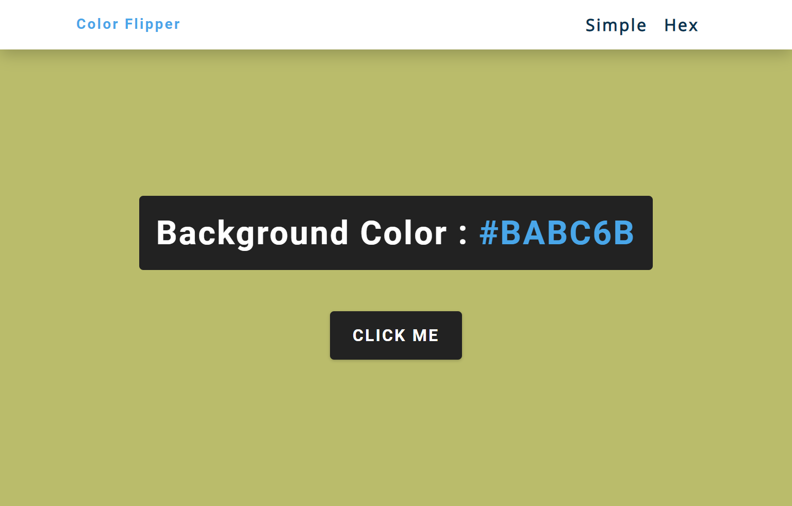
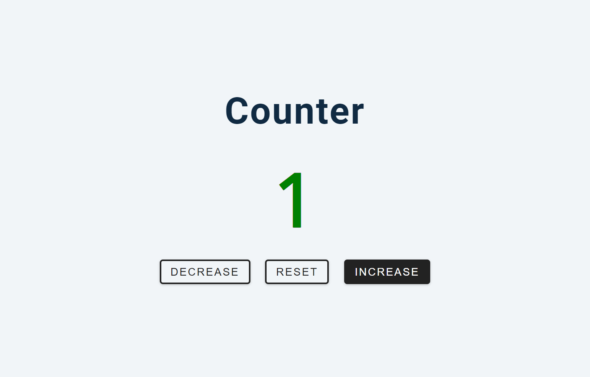
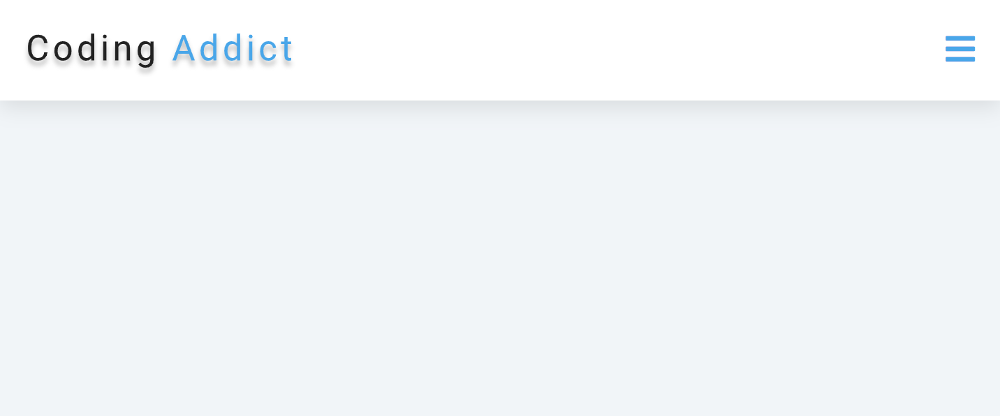
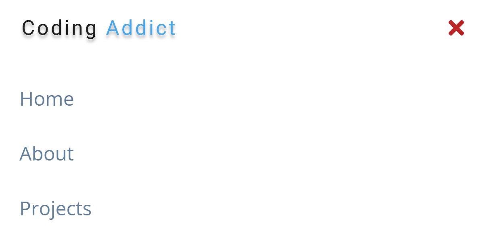
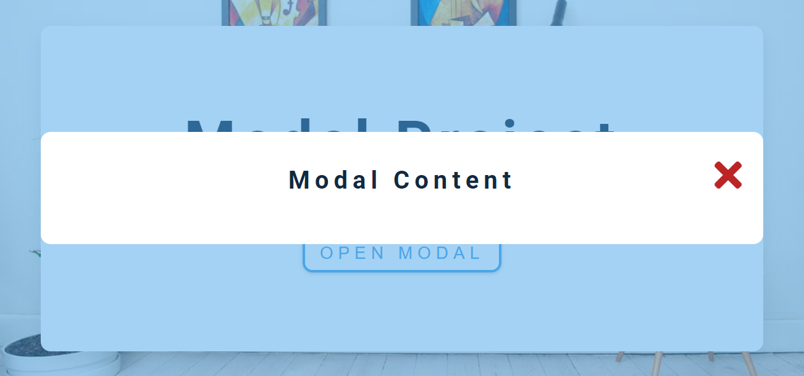
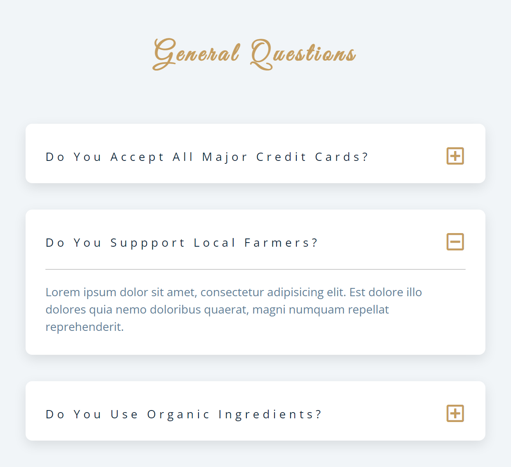
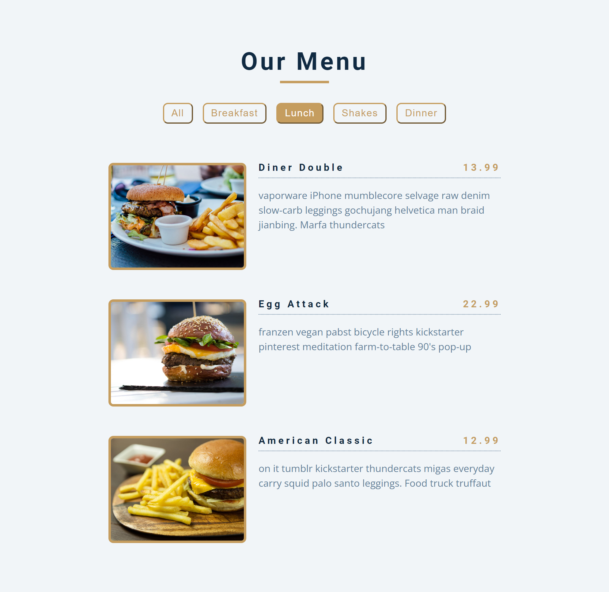

## This repo contains 15 small projects created using vanilla JS, html-5 and css-3.
1. *color-flipper*

1. *counter*

1. *reviews*

1. *navbar*

1. *sidebar*

1. *modal*

1. *questions*

1. *menu*

1. *video*

1. *scroll*

